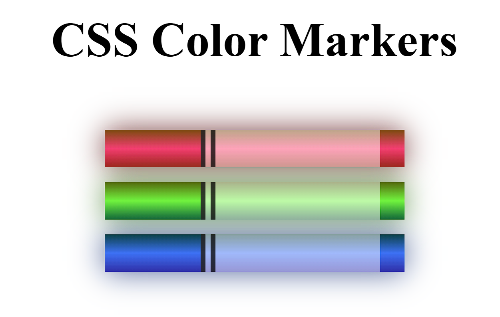

# 🎨 CSS Color Markers

A simple HTML and CSS project that displays a set of colorful marker pens using gradients and shadows.

## 📷 Project Screenshot

## 🔧 Technologies Used

- HTML
- CSS

## 📄 Description

This project visually represents three colored markers (red, green, and blue) using CSS styling techniques like:

- Linear gradients
- Box shadows
- RGBA and HSL color values
- Basic layout with `div` elements

It's a great practice for understanding how CSS colors and gradients work.

## 🔗 Reference

This project is based on a tutorial from FreeCodeCamp:  
[Learn CSS Colors by Building a Set of Colored Markers](https://www.freecodecamp.org/learn/2022/responsive-web-design/learn-css-colors-by-building-a-set-of-colored-markers/step-1)
